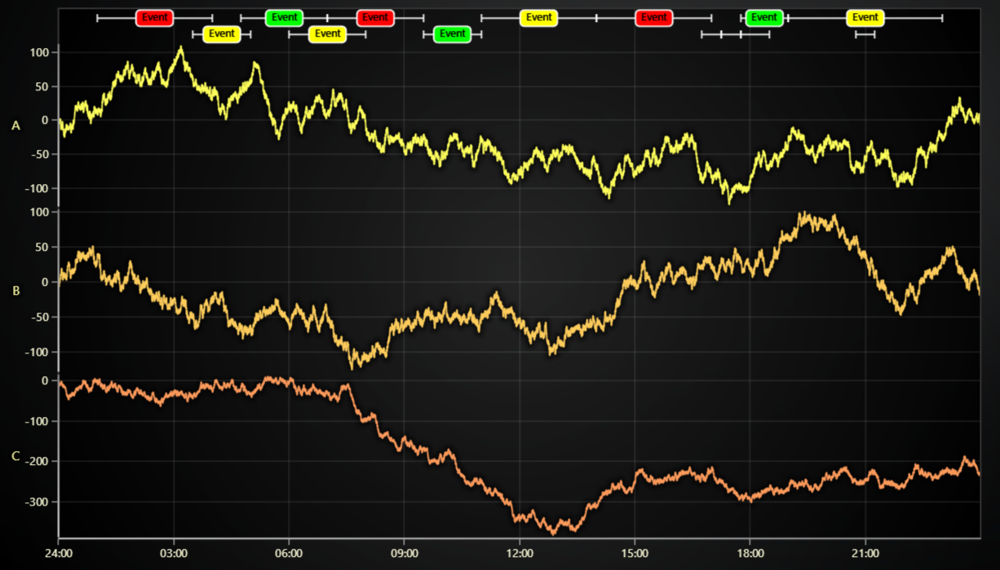

# JavaScript Time Series Annotations Chart

This demo application belongs to the set of examples for LightningChart JS, data visualization library for JavaScript.

LightningChart JS is entirely GPU accelerated and performance optimized charting library for presenting massive amounts of data. It offers an easy way of creating sophisticated and interactive charts and adding them to your website or web application.

The demo can be used as an example or a seed project. Local execution requires the following steps:

-   Make sure that relevant version of [Node.js](https://nodejs.org/en/download/) is installed
-   Open the project folder in a terminal:

          npm install              # fetches dependencies
          npm start                # builds an application and starts the development server

-   The application is available at _http://localhost:8080_ in your browser, webpack-dev-server provides hot reload functionality.

## Description

Example of displaying annotations in a time series line chart.
In this example context, each annotation has a start time, end time, background color and text to display.
They are displayed using a combination of `RectangleSeries`, `TextSeries` and `SegmentSeries` (for line segments).

These series types are optimized for rendering large numbers of objects, so applications can even have thousands of this kinds of annotations loaded in simultaneously.

This example showcases:

-   Automatic logic for hiding labels and background rectangles when they would extend past the annotations start / end time.
-   Custom interactions to:
    -   Create annotations by dragging mouse (LMB) over series area
    -   Delete annotation by double clicking on its text
    -   Drag on annotations whiskers to change start / end time

Naturally, this is just an example of one possible way of displaying annotations in a chart. The main goal here is to give a reference how the `FigureSeries` can be used along with custom user interactions.

## API Links

* [XY cartesian chart]
* [Axis]
* [Rectangle series]
* [Rectangle figure]
* [Segment series]
* [Segment figure]
* [Text series]
* [Text figure]

## Support

If you notice an error in the example code, please open an issue on [GitHub][0] repository of the entire example.

Official [API documentation][1] can be found on [LightningChart][2] website.

If the docs and other materials do not solve your problem as well as implementation help is needed, ask on [StackOverflow][3] (tagged lightningchart).

If you think you found a bug in the LightningChart JavaScript library, please contact sales@lightningchart.com.

Direct developer email support can be purchased through a [Support Plan][4] or by contacting sales@lightningchart.com.

[0]: https://github.com/Arction/
[1]: https://lightningchart.com/lightningchart-js-api-documentation/
[2]: https://lightningchart.com
[3]: https://stackoverflow.com/questions/tagged/lightningchart
[4]: https://lightningchart.com/support-services/

© LightningChart Ltd 2009-2022. All rights reserved.

[XY cartesian chart]: https://lightningchart.com/js-charts/api-documentation/v7.0.1/classes/ChartXY.html
[Axis]: https://lightningchart.com/js-charts/api-documentation/v7.0.1/classes/Axis.html
[Rectangle series]: https://lightningchart.com/js-charts/api-documentation/v7.0.1/classes/RectangleSeries.html
[Rectangle figure]: https://lightningchart.com/js-charts/api-documentation/v7.0.1/classes/RectangleFigure.html
[Segment series]: https://lightningchart.com/js-charts/api-documentation/v7.0.1/classes/SegmentSeries.html
[Segment figure]: https://lightningchart.com/js-charts/api-documentation/v7.0.1/classes/SegmentFigure.html
[Text series]: https://lightningchart.com/js-charts/api-documentation/v7.0.1/classes/TextSeries.html
[Text figure]: https://lightningchart.com/js-charts/api-documentation/v7.0.1/classes/TextFigure.html

